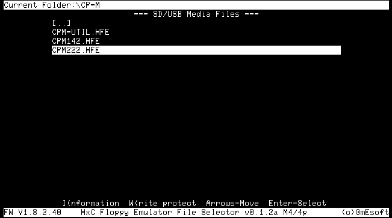
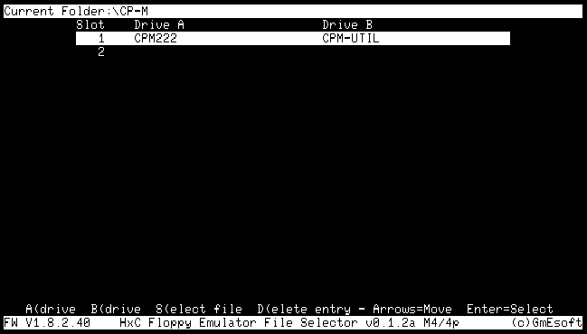

TRS80_HxC: TRS-80 HxC-2001 Disk Image Selector
==============================================

Presentation
------------

The  HxC Floppy Emulator  is a piece of hardware that can emulate 1 or 2 floppy
drives using image files stored into an SD or SDHC card. More information about
the design of this device on the HxC2001 site:

  http://hxc2001.com/

The  HxC Floppy  Emulator is  built and  sold by  Lotharek and  can be  ordered
here:

  http://www.lotharek.pl/

This project **TRS80_HxC** aims at developing a bootable utility allowing
the TRS-80 user to pre-select one or two disk images into
"slot" positions. The user can then select a slot in a list
and boot the computer on it.

This tool can be used either as a bootable image (`AUTOBOOT.HFE`)
or an LS-DOS 6 executable (`HXC/CMD`).

It configures the HxC-2001 Floppy Emulator in slot mode, each
slot referencing one or two disk images for drives A: and B:
(or :0 and :1).

Currently, this tool can be run on TRS-80 models 4/4D and 4p.

_A pre-release version (v0.1.2-alpha) can be found in the Releases section._

Usage
-----

### Bootable version

Copy the `AUTOBOOT.HFE` file to the root folder on the SD card.
Insert the SD card in the Floppy Emulator and power on the system.
Select `AUTOBOOT.HFE` and let the system boot on it.

A welcome screen appears. Press any key to show the slot selector.
At first, the list of slots appears empty. 

We'll first select a system disk image for drive A: (or :0). Let's
press the `A` key. We get a choice of options:
- `S`: select a disk image to use as A: drive;
- `D`: delete the entry from the list;
- `C`: change slot (return to the main selection menu).

We press the S key to select an image. We get a file selector, which
allows us to browse the available .HFE files and folders on the
SD card. After moving the cursor on a .HFE file, we have a new
choice of options:
- `I`: Information - show some information on the selected file, such
  as the number of tracks, the density (single or double), the number
  of sides, the stepping of the head between tracks (1 or 2 steps)
  and the Write-Protect status;
- `W`: Write-Protect - shows the current write-protect status, and
  allows to change it (by pressing `Y` or `N`). Press `ENTER` to keep
  the current setting. Note that this alters a flag in the header
  of the .HFE disk image file;
- `ENTER`: Select the file image for the selected drive (A: or B:)
  in the current slot.

Let's select a bootable disk image and press `ENTER`. The name of the 
selected disk image is shown in the list of slots under the column
`Drive A`.

If the Floppy Emulator is installed in the system to emulate two
floppy drives, we can select another disk image to use as drive B:
(or :1). We'll repeat the same procedure as above but pressing the
key `B` instead of `A`. We'll see the name of another disk image under
the column `Drive B`.

We can now boot the system on the selected slot. If we press ENTER,
the first time we'll see `Enter=REBOOT` in the help line at the
bottom of the screen. If we press `ENTER` again, the system will
boot using the drive(s) in the selected slot.

If we power off the TRS-80, then power it on again, the system will
reboot on the `AUTOBOOT.HFE`, showing the slots selector, with the
cursor on the last used slot.

We can also use the buttons on the Floppy Emulator to cycle through 
the configured slots (using the left and right buttons) and to directly
select `AUTOBOOT.HFE` (using the center button).

The maximum number of slots depends on the size of the `HXCSDFE.CFG` 
file in the root folder of the SD card. By default, this number is 
limited to 55 for a file size of 8 kB.

Another limitation is the number of image files per folder on the
SD card. The browser can show up to 255 files and folders. Hence
the maximum number of .HFE files is 255 minus the number of folders
(including the up-folder `[..]`) in each folder.

### Executable version HXC/CMD

In LS-DOS 6, the tool can be invoked from the command line.
Copy `HXC/CMD` to an LS-DOS 6 formatted diskette image. To invoke it,
type the command `HXC`. The operation is identical as with the bootable
version of the tool.

Credits
-------

**HxC Floppy Emulator File Selector** would not  have  been possible without  
the  contribution of  the following people:

_Jean-Francois Del Nero_ who designed that fantastic piece of hardware, the HxC
Floppy Emulator.

_Przemyslaw "Lotharek" Krawczyk_ from  Poland, who builds  and sells HxC Floppy
Emulators.

Many thanks to them!

GPLv3 License
-------------

Created by Michel Bernard (michel_bernard@hotmail.com) - 
<http://www.github.com/GmEsoft/TRS80_HxC>

Copyright (c) 2023 Michel Bernard. All rights reserved.

This file is part of TRS80_HxC.

TRS80_HxC is free software: you can redistribute it and/or modify
it under the terms of the GNU General Public License as published by
the Free Software Foundation, either version 3 of the License, or
(at your option) any later version.

TRS80_HxC is distributed in the hope that it will be useful,
but WITHOUT ANY WARRANTY; without even the implied warranty of
MERCHANTABILITY or FITNESS FOR A PARTICULAR PURPOSE.  See the
GNU General Public License for more details.

You should have received a copy of the GNU General Public License
along with TRS80_HxC.  If not, see <https://www.gnu.org/licenses/>.
